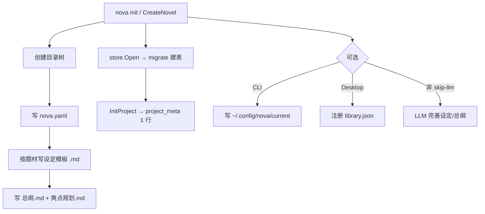

# 新书 Init 目录结构与 SQLite 说明

基于当前代码（`project.InitProject` + `store.Open`/`migrate`）的实际行为整理。Init 完成后**只创建骨架**；`审查/`、`摘要/`、`run_ledger.json`、章节子目录等会在后续写章/审查流程中才出现。

---

## 一、Init 后的目录结构（玄幻题材示例）

```
my-novel/
├── nova.yaml                          # 项目元数据
├── .nova/
│   ├── nova.db                        # SQLite 索引库
│   └── backups/                       # 空目录，备份用
├── 设定集/
│   ├── 角色/
│   │   ├── 主角卡.md
│   │   └── 反派设计.md
│   ├── 世界/
│   │   ├── 世界观.md
│   │   ├── 力量体系.md
│   │   └── 金手指.md
│   ├── 势力/                          # 空目录
│   ├── 地点/                          # 空目录
│   ├── 物品/                          # 空目录
│   └── 其他/                          # 空目录
├── 大纲/
│   ├── 总纲.md
│   └── 爽点规划.md
└── 正文/                              # 空目录（写章后变为 正文/第001章-标题/…）
```

### Init 时不会创建

- `审查/`、`摘要/`（旧版平铺布局，仅迁移用）
- `.nova/run_ledger.json`（写章断点续跑时才写）
- 任何章节文件

### 写章后的新布局（供对比）

章节按子目录组织，审查/摘要与正文同目录：

```
正文/第001章-标题/
├── 正文.md
├── 审查.md
├── 摘要.md
└── AI味.md          # 可选
```

---

## 二、各目录 / 文件：作用、内容、写入时间

> 写入时间示例来自 `nova init --skip-llm` 实测（2026-07-04 14:49:20 +0800）。Init 时所有文件在同一秒创建；空目录没有独立「文件写入时间」。

### 根目录

| 路径 | 作用 | 内容概要 | 写入时间 |
|------|------|----------|----------|
| `nova.yaml` | 项目元数据真源 | 书名、题材、phase、卷/章进度、风格、字数目标、简介、主角、金手指等 | Init 时刻 |

示例内容：

```yaml
title: 示例小说
genre: 玄幻
phase: init_done
current_volume: 0
current_chapter: 0
tone: 热血
style: 热血
target_words: 300000
chapter_words: 4000
synopsis: 一个少年的逆袭之路
protagonist: 林凡
cheat: 系统面板
```

### `.nova/`

| 路径 | 作用 | 内容概要 | 写入时间 |
|------|------|----------|----------|
| `.nova/nova.db` | SQLite 索引库 | 表结构 + 初始 `project_meta` 一行 | Init 时刻 |
| `.nova/backups/` | 自动/手动备份 | Init 时空目录 | 目录创建时间 ≈ Init 时刻 |

### `设定集/`（按子目录分类，与 Studio 侧边栏对齐）

| 路径 | 作用 | 内容概要 | 写入时间 |
|------|------|----------|----------|
| `设定集/角色/主角卡.md` | 主角设定 | 预填姓名（来自 init 参数），性格/背景/目标/成长弧线待填 | Init 时刻 |
| `设定集/角色/反派设计.md` | 反派设定 | 标题 + `## 待补充` | Init 时刻 |
| `设定集/世界/世界观.md` | 世界观 | 标题 + `## 待补充` | Init 时刻 |
| `设定集/世界/力量体系.md` | 力量/等级体系 | 标题 + `## 待补充` | Init 时刻 |
| `设定集/世界/金手指.md` | 金手指 | 预填能力（来自 init），限制/升级路线待填 | Init 时刻 |
| `设定集/势力/` | 势力关系设定 | 空（都市/科幻 init 会在此放 `势力关系.md`） | — |
| `设定集/地点/` | 地点设定 | 空 | — |
| `设定集/物品/` | 物品设定 | 空 | — |
| `设定集/其他/` | 其他设定 | 空 | — |

**题材差异**（决定 init 生成哪些 `.md`）：

| 题材 | 生成的设定文件 |
|------|----------------|
| 玄幻（默认） | 世界观、力量体系、主角卡、金手指、反派设计 |
| 都市 | 世界观、主角卡、金手指、势力关系 |
| 科幻 | 世界观、科技体系、主角卡、势力关系 |
| 其他 | 回退到玄幻模板 |

**设定文件放置规则**（`SettingFileSubdir`）：

| 文件名 | 子目录 |
|--------|--------|
| 主角卡.md、反派设计.md | 角色 |
| 世界观.md、力量体系.md、科技体系.md、金手指.md | 世界 |
| 势力关系.md | 势力 |
| 其他 | 其他 |

### `大纲/`

| 路径 | 作用 | 内容概要 | 写入时间 |
|------|------|----------|----------|
| `大纲/总纲.md` | 全书总纲 | 梗概、核心冲突、主线、创作目标、分卷规划表、基调 | Init 时刻 |
| `大纲/爽点规划.md` | 爽点节奏规划 | 大/中/微爽点、追读力设计模板 | Init 时刻 |

### `正文/`

| 路径 | 作用 | 内容 | 写入时间 |
|------|------|------|----------|
| `正文/` | 章节根目录 | Init 时空目录 | — |

---

## 三、Init 之外的全局文件（CLI / Desktop 附加）

| 路径 | 何时写入 | 作用 |
|------|----------|------|
| `~/.config/nova/current` | CLI `nova init` | 记录当前默认项目路径 |
| `~/.config/nova/library.json` | Desktop `CreateNovel` | 书库索引，注册新书卡片 |
| `~/.config/nova/config.yaml` | 单独配置 | API Key 等，**不是** init 创建 |

---

## 四、SQLite（`.nova/nova.db`）表结构

Init 时 `store.Open` → `migrate()` 建表；随后 `InitProject()` 写入 `project_meta` 一行。

**说明：** SQLite 没有「表级写入时间」。Init 后只有带时间字段的表有数据时间；其余表为空。

### 业务表（11 张）

#### 1. `project_meta` — 项目元数据镜像

| 列 | 类型 | 说明 |
|----|------|------|
| `root` | TEXT PK | 项目根目录绝对路径 |
| `title` | TEXT | 书名 |
| `genre` | TEXT | 题材 |
| `phase` | TEXT | 创作阶段 |
| `updated_at` | TEXT | 最后同步时间（RFC3339 UTC） |

**作用：** 与 `nova.yaml` 同步，便于 SQL 查询和 Dashboard。

**Init 数据：** 1 行，`updated_at` 为 Init 时刻（UTC）。

---

#### 2. `chapters` — 章节索引（读模型）

| 列 | 类型 | 说明 |
|----|------|------|
| `number` | INTEGER PK | 章号 |
| `title` | TEXT | 标题 |
| `word_count` | INTEGER | 字数 |
| `path` | TEXT | 正文路径 |
| `summary_path` | TEXT | 摘要路径 |
| `status` | TEXT | draft / reviewed / published |
| `updated_at` | TEXT | 最后更新 |

**作用：** 正文真源在磁盘；此表做索引与状态。

**Init：** 0 行，无写入时间。

---

#### 3. `entities` — 故事实体（角色/地点/物品等）

| 列 | 类型 | 说明 |
|----|------|------|
| `id` | TEXT PK | 实体 ID |
| `type` | TEXT | character / location / item 等 |
| `name` | TEXT | 显示名 |
| `state_json` | TEXT | 当前状态 JSON |
| `last_chapter` | INTEGER | 最后更新章号 |

**作用：** 一致性校验、`nova query` 检索。

**Init：** 0 行。

---

#### 4. `foreshadows` — 伏笔追踪

| 列 | 类型 | 说明 |
|----|------|------|
| `id` | TEXT PK | 伏笔 ID |
| `description` | TEXT | 描述 |
| `planted_chapter` | INTEGER | 埋设章 |
| `resolved_chapter` | INTEGER | 回收章 |
| `status` | TEXT | open / resolved |

**Init：** 0 行。

---

#### 5. `memories` — 长期记忆

| 列 | 类型 | 说明 |
|----|------|------|
| `id` | TEXT PK | 记忆 ID |
| `category` | TEXT | style / plot / character / world |
| `subject` | TEXT | 主题关键词 |
| `content` | TEXT | 正文 |
| `source_chapter` | INTEGER | 来源章（0=手动） |
| `status` | TEXT | active / archived |
| `created_at` | TEXT | 创建时间 RFC3339 |

**Init：** 0 行。

---

#### 6. `reviews` — 审查结果

| 列 | 类型 | 说明 |
|----|------|------|
| `chapter_number` | INTEGER PK | 章号 |
| `hook_score` | REAL | 章末钩子 0–10 |
| `cool_point` | TEXT | 爽点兑现 |
| `debt` | TEXT | 悬念债务 |
| `report_json` | TEXT | 完整审查 JSON |
| `path` | TEXT | 审查 Markdown 路径 |

**Init：** 0 行。

---

#### 7. `cool_points` — 爽点追踪

| 列 | 类型 | 说明 |
|----|------|------|
| `id` | TEXT PK | ID |
| `chapter` | INTEGER | 章号 |
| `type` | TEXT | micro / medium / major |
| `description` | TEXT | 描述 |
| `delivered` | INTEGER | 0 / 1 |

**Init：** 0 行。

---

#### 8. `entity_state_history` — 实体状态历史

| 列 | 类型 | 说明 |
|----|------|------|
| `entity_id` | TEXT | 实体 ID |
| `chapter` | INTEGER | 章号 |
| `state_json` | TEXT | 状态快照 |
| `recorded_at` | TEXT | 记录时间 |
| PK | `(entity_id, chapter)` | |

**作用：** 实体时间线展示。

**Init：** 0 行。

---

#### 9. `embeddings` — 向量索引

| 列 | 类型 | 说明 |
|----|------|------|
| `id` | TEXT PK | ID |
| `kind` | TEXT | chapter / setting / summary |
| `ref_id` | TEXT | 引用 ID |
| `text` | TEXT | 原文 |
| `vector` | BLOB | 向量 |
| `updated_at` | TEXT | 更新时间 |

**Init：** 0 行。

---

#### 10. `schema_meta` — schema 版本/配置

| 列 | 类型 | 说明 |
|----|------|------|
| `key` | TEXT PK | 键 |
| `value` | TEXT | 值 |

**Init 数据：** 1 行 — `fts_tokenizer = trigram`（FTS 分词器迁移标记，无时间戳）。

---

### FTS 虚拟表（2 张 + 内部辅助表）

#### 11. `chapters_fts`（FTS5 虚拟表）

| 列 | 说明 |
|----|------|
| `chapter_number` | 章号（UNINDEXED） |
| `title` | 标题 |
| `content` | 正文全文 |

**分词器：** `trigram`

**作用：** `nova query` 章节全文检索。

**Init：** 0 条索引。

#### 12. `settings_fts`（FTS5 虚拟表）

| 列 | 说明 |
|----|------|
| `file_path` | 设定文件路径（UNINDEXED） |
| `content` | 设定全文 |

**Init：** 0 条索引。

FTS5 还会自动创建辅助表（`chapters_fts_data/_idx/_content/_docsize/_config` 等），Init 时仅有结构，无业务数据。

---

## 五、Init 后 SQLite 数据快照

| 表 | 行数 | 有写入时间的字段 | Init 时的值 |
|----|------|------------------|-------------|
| `project_meta` | 1 | `updated_at` | Init 时刻（RFC3339 UTC） |
| `schema_meta` | 1 | 无 | `fts_tokenizer=trigram` |
| 其余 10 张业务/FTS 表 | 0 | — | 无数据 |

**整个 `nova.db` 文件系统 mtime：** 与 Init 时刻一致。

---

## 六、Init 流程小结



---

## 七、相关源码

| 文件 | 职责 |
|------|------|
| `internal/project/init.go` | 创建目录、模板文件、`nova.yaml` |
| `internal/project/settings_layout.go` | 设定集子目录分类 |
| `internal/project/chapter_layout.go` | 写章后的章节目录布局 |
| `internal/store/sqlite.go` | SQLite 建表与 `InitProject` |
| `cmd/nova/init.go` | CLI init 入口 |
| `desktop/app.go` | Desktop `CreateNovel` |
