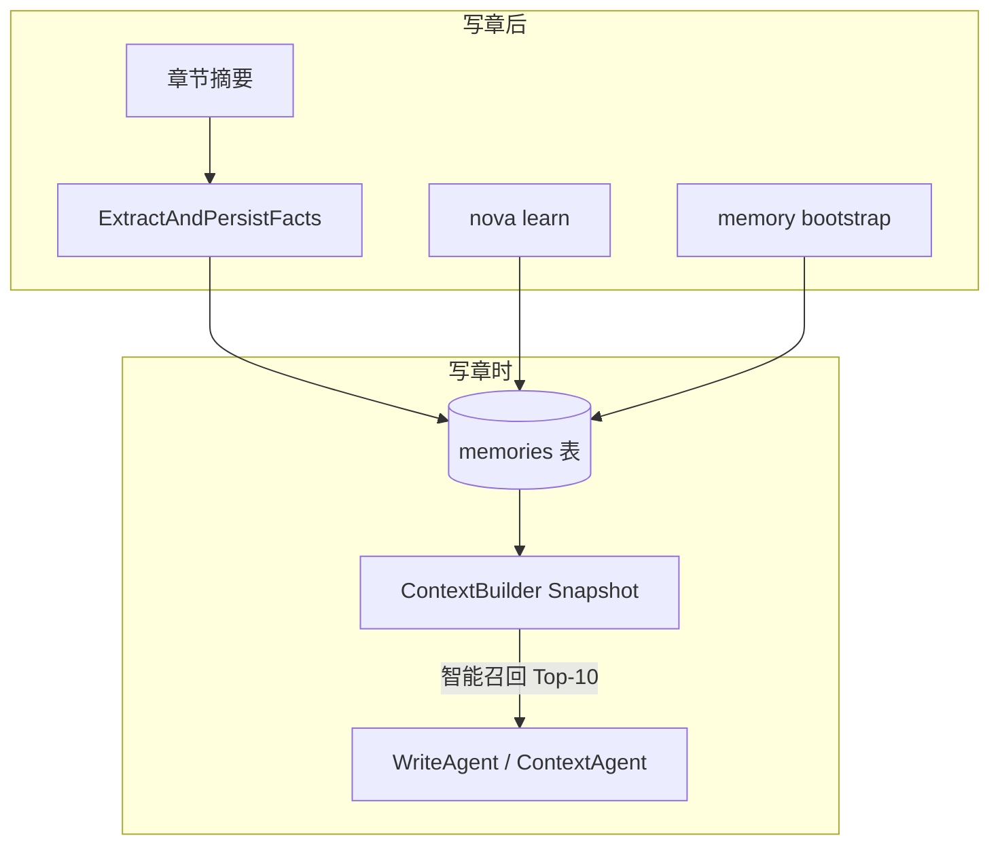
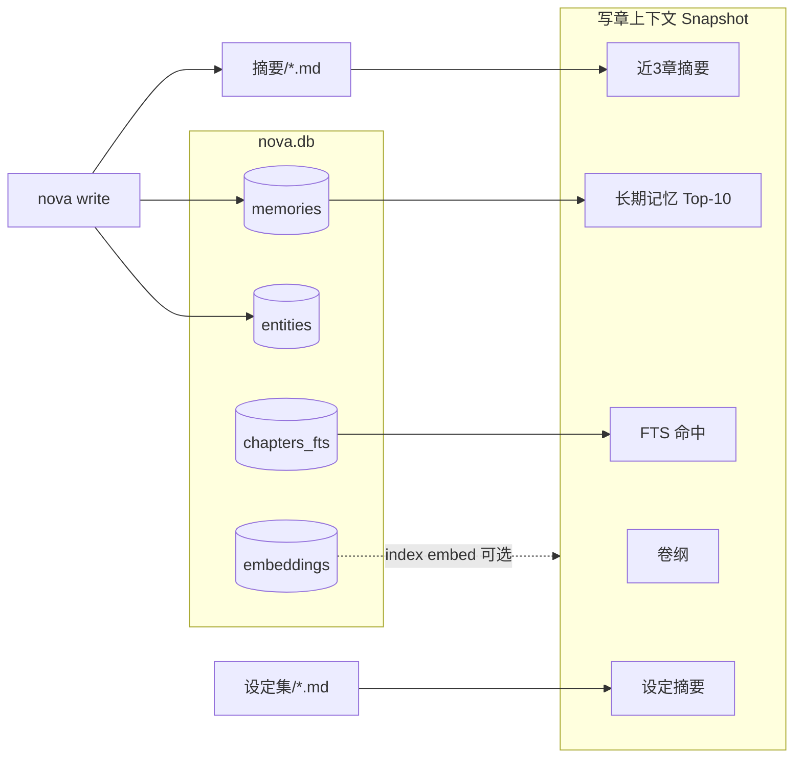

# nova 长期记忆模块设计

> 版本：v0.1（与当前代码实现对齐）  
> 最后更新：2026-06-25

---

## 1. 目标与定位

### 1.1 要解决的问题

长篇网文连载中，LLM 容易：

- **遗忘**：几十章前的设定、写法约定、角色状态记不全
- **幻觉**：凭空编造与已有设定矛盾的情节

记忆模块的目标是把「值得长期保留的知识」从章节创作流程中**沉淀下来**，并在下次写章时**主动注入上下文**，而不是依赖模型从海量历史对话里回忆。

### 1.2 在整体架构中的位置

nova 采用 **Markdown 真源 + SQLite 读模型**：

| 层级 | 存储 | 记忆相关 |
|------|------|----------|
| 真源 | `设定集/`、`摘要/`、`正文/` | 人类可读、可手改 |
| 读模型 | `.nova/nova.db` → `memories` 表 | 结构化、可查询、可注入 prompt |

记忆模块**不单独占 Markdown 文件**（与 webnovel-writer 的 `project_memory.json` 不同），统一落在 SQLite 的 `memories` 表中。



### 1.3 与非目标

| 非目标 | 说明 |
|--------|------|
| 替代 `entities` 表 | 角色/物品**结构化状态**走 `entities`，记忆存**叙述性/模式性**知识 |
| 替代 `摘要/` | 摘要链负责**近章剧情连贯**；记忆负责**跨章可复用**条目 |
| 替代 FTS / 向量索引 | FTS/embedding 做**全文召回**；记忆做**精选 Top-K 注入** |
| 会话历史 | 不存 LLM 多轮 chat，只存提炼后的条目 |

---

## 2. 数据模型

### 2.1 表结构

存储于 `.nova/nova.db`：

```sql
CREATE TABLE memories (
  id TEXT PRIMARY KEY,         -- UUID
  category TEXT,               -- style | plot | character | world
  subject TEXT,                -- 主题关键词
  content TEXT,                -- 记忆正文
  source_chapter INTEGER,      -- 来源章号，0=初始化/手动
  status TEXT,                 -- active | archived（当前主要用 active）
  created_at TEXT              -- RFC3339
);
```

Go 结构体：`internal/store/sqlite.go` → `store.Memory`

### 2.2 字段语义

| 字段 | 说明 | 示例 |
|------|------|------|
| `id` | 主键，UUID | `550e8400-e29b-...` |
| `category` | 四维分类（见下节） | `style` |
| `subject` | 检索与去重键之一 | `章末危机钩` |
| `content` | 可注入 prompt 的正文 | `第12章用「倒计时+未知来客」制造悬念，效果好` |
| `source_chapter` | 产生该记忆的章号 | `12`；bootstrap 为 `0` |
| `status` | 生命周期 | 默认 `active` |
| `created_at` | 写入/更新时间 | `2026-06-25T08:00:00Z` |

### 2.3 分类（category）

| 值 | 含义 | 典型内容 |
|----|------|----------|
| `style` | 写法/节奏/叙事技巧 | 危机钩设计、对话节奏、POV 约定 |
| `plot` | 情节模式/主线约束 | 退婚流节奏、副本结构、禁忌（不可写死的设定） |
| `character` | 角色行为/OOC 边界 | 主角不轻易杀人、反派嘴炮风格 |
| `world` | 世界观/规则摘要 | 境界体系要点、势力关系（设定集的压缩版） |

`bootstrap` 回填设定集时统一使用 `world`，`subject` 为文件名（如 `主角卡`）。

---

## 3. 读写闭环

### 3.1 写前注入（Read Path）

**入口**：`internal/context/builder.go` → `Builder.Build` + `internal/context/recall.go`

组装 `Snapshot.Memories` 时走 **智能召回**（Q1-A）：

| 阶段 | 能力 | 说明 |
|------|------|------|
| **A1 规则召回** | 章纲/摘要关键词 + 主角/金手指锚点 + entities 匹配 | 对 active 记忆打分排序 |
| **A2 语义召回** | 章纲 + 近 3 章摘要 → embedding Top-K | 需 `OPENAI_API_KEY` 且执行过 `nova index embed`（含 memories） |
| **A3 预算控制** | 记忆段上限约 2400 字 | Top-10 条，超出预算截断 |
| **融合** | RRF（k=60） | 规则与语义双路命中加权 |
| **回退** | 无命中时 | 按 `created_at DESC` 取最近 10 条（兼容旧行为） |

FTS 检索同步增强：用章纲关键词 + 章号构造 `SearchFTS` 查询。

注入路径：

```
memories 表 → RecallMemories → Snapshot.Memories + MemoryRecalls → ContextAgent / WriteAgent
```

`MemoryRecalls[]` 含 `source`（rule/semantic/rrf/fallback）与 `reason`（选中理由），Desktop `WriteContextPanel` 可展示。

在 `ToPrompt()` 中位于「长期记忆」段落，与卷纲、近章摘要、设定摘要、FTS 命中并列。

### 3.2 写后沉淀（Write Path）

写章流水线（`internal/workflows/write.go`）在 **Step 4 写后沉淀** 调用：

```
ExtractAndPersistFacts(ctx, agent, store, chapter, content, summary)
```

同一函数在 **`nova review`** 完成后也会调用（用正文 + 已有摘要补充提取）。

提取逻辑见 `internal/workflows/extract.go`：

1. LLM + `prompts.ExtractSystem()`，输入章号、摘要、正文前 8000 字
2. 解析 JSON 中的 `memories[]`
3. 每条调用 `store.UpsertMemory`

此外，摘要生成步骤使用 `prompts.MemorySystem()`，但**当前实现中摘要文本写入 `摘要/` 文件，不直接写 memories 表**；记忆入库主要依赖 `ExtractAndPersistFacts`。

---

## 4. 记忆写入来源

### 4.1 来源一览

| 来源 | 触发时机 | 实现 | category 典型值 |
|------|----------|------|----------------|
| **Bootstrap** | `nova init`（LLM 完善设定后）/ `nova memory bootstrap` | `internal/memory/bootstrap.go` | `world` |
| **写章提取** | `nova write` 完成 Step 4 | `ExtractAndPersistFacts` | 四维均有 |
| **审查提取** | `nova review` 完成 | 同上 | 四维均有 |
| **手动学习** | `nova learn "..."` | `LearnWorkflow` + `LearnSystem` | LLM 判定 |
| **Agent 工具** | 规划/审查 Agent 调用 `update_memory` | `internal/tools/registry.go` | 调用方指定 |

### 4.2 Bootstrap（设定集回填）

`BootstrapFromSettings` 遍历 `设定集/*.md`：

- `subject` = 文件名（去 `.md`）
- `content` = 文件内容，**截断至 600 字**
- `source_chapter` = `0`
- `category` = `world`

`nova init` 在 LLM 完善设定成功后**自动执行**一次 bootstrap。

### 4.3 Learn（作者手动沉淀）

```bash
nova learn "本章危机钩设计很有效，悬念拉满"
```

流程：

1. `LearnSystem` prompt 要求输出 JSON：`{category, subject, content}`
2. `UpsertMemory` 写入，`source_chapter` = `nova.yaml` 的 `current_chapter`

适用于：作者明确认可某写法、审查结论、临时经验，无需等自动提取。

### 4.4 Extract（自动事实提取）

`ExtractSystem` 在一次 LLM 调用中同时提取 entities / foreshadows / cool_points / **memories**。

记忆条目 JSON：

```json
{
  "category": "style",
  "subject": "章末钩子",
  "content": "以未知脚步声收尾，未揭示身份"
}
```

与 entities 的区别：

| | memories | entities |
|--|----------|----------|
| 内容 | 自然语言叙述 | 结构化 `state_json` |
| 用途 | 注入写作风格/约束 | 一致性校验、query 实体 |
| 去重键 | category + subject | type + name |

### 4.5 Tool：`update_memory`

注册于 `ToolRegistry`，供 Plan/Review 等带工具的 Agent 在推理过程中写入记忆。

参数：`category`, `subject`, `content`, `chapter`（可选）

内部同样走 `UpsertMemory`。

---

## 5. 去重与冲突

### 5.1 Upsert 策略

`store.UpsertMemory`（`internal/store/sqlite.go`）：

```
查找：category + subject + status='active' 是否已存在
  ├─ 存在 → UPDATE content, source_chapter, created_at（保留原 id）
  └─ 不存在 → INSERT 新行（自动生成 id）
```

**设计意图**：同一主题（如「主角性格」）只保留一条 active 记忆，新内容**覆盖**旧内容，避免无限膨胀。

返回值 `(inserted bool)`：`true` 表示新插入，`false` 表示更新。

### 5.2 冲突检测

`FindMemoryConflicts`：

```sql
SELECT subject, COUNT(*) FROM memories
WHERE status='active'
GROUP BY subject HAVING cnt > 1
```

检测的是：**同一 `subject` 下存在多条 active 记录**（通常来自不同 `category` 写了相同 subject，或 upsert 键未命中）。

CLI：

```bash
nova memory conflicts
nova memory conflicts --format json
```

**当前限制**：只报告冲突，**不自动合并或归档**；需作者人工判断后改 subject 或手动清理。

---

## 6. 查询与运维

### 6.1 CLI 命令

| 命令 | 说明 |
|------|------|
| `nova memory stats` | 按 category 统计数量 |
| `nova memory query [--category] [--subject]` | 过滤查询，最多 50 条 |
| `nova memory dump` | 导出全部记忆（JSON） |
| `nova memory bootstrap` | 从设定集回填 |
| `nova memory conflicts` | 列出 subject 冲突 |
| `nova learn [内容]` | 手动沉淀一条 |
| `nova query [关键词]` | 混合检索，subject/content LIKE 匹配记忆 |

### 6.2 HTTP API（Dashboard / Daemon）

| 端点 | 说明 |
|------|------|
| `GET /api/memories` | 最近 100 条 active 记忆 |

### 6.3 状态面板

`nova status` 输出 `memory_count`（`internal/status/status.go`），来自 `MemoryStats()` 总量。

---

## 7. 与相关模块的协作



| 模块 | 与记忆的关系 |
|------|----------------|
| **摘要链** (`摘要/`) | 近章剧情；记忆不管「上一章发生了什么」，管「该怎么写」 |
| **entities** | 同事务提取，结构化；记忆是叙述性补充 |
| **foreshadows** | 同事务提取，专管伏笔状态 |
| **FTS** | 按关键词召回原文片段；记忆是预提炼结论 |
| **embeddings** | `nova index embed` 语义检索；与 memories 并行，尚未在 Build 中融合 |
| **ledger** | 记录 `extract` 步骤成功/失败，不存记忆内容 |

---

## 8. Prompt 设计

| Prompt | 文件 | 用途 |
|--------|------|------|
| `MemorySystem()` | `internal/prompts/prompts.go` | 生成章节摘要（200–400 字） |
| `LearnSystem()` | 同上 | `nova learn` 提炼单条 JSON |
| `ExtractSystem()` | 同上 | 写后/审后批量提取，含 `memories[]` |
| `ContextSystem()` | 同上 | 读 Snapshot（含记忆段）生成任务书 |

`ExtractSystem` 对记忆的要求：**严格依据文本，不编造**。

---

## 9. 包与文件结构

```
internal/
├── store/sqlite.go          # Memory 结构体、CRUD、UpsertMemory、FindMemoryConflicts
├── memory/bootstrap.go      # BootstrapFromSettings
├── context/
│   ├── builder.go       # 写前组装 Snapshot
│   ├── recall.go        # 智能记忆召回（规则 + 语义 RRF）
│   └── keywords.go      # 章纲关键词提取
├── workflows/
│   ├── extract.go           # ExtractAndPersistFacts
│   └── write.go             # LearnWorkflow、写章/审查调用链
├── tools/registry.go        # update_memory 工具
└── prompts/prompts.go       # MemorySystem / LearnSystem / ExtractSystem

cmd/nova/
├── memory.go                # memory 子命令
└── learn.go                 # learn 命令
```

---

## 10. 典型时序

### 10.1 新书从 init 到写第一章

```
nova init --interactive
  → 生成设定集/
  → LLM 完善设定
  → BootstrapFromSettings（world 类记忆）

nova plan 1
nova write 1
  → Build：注入 memories Top-10 + 摘要 + 设定 + 卷纲
  → 写完后 ExtractAndPersistFacts → 新增 style/plot/character 记忆
```

### 10.2 作者认可某写法

```
nova review 5
nova learn "第5章双线切换节奏好，可复用"
  → UpsertMemory(category=style, subject=...)
nova write 6
  → Build 注入含该条记忆
```

---

## 11. 已知限制与后续方向

| 限制 | 说明 | 可能改进 |
|------|------|----------|
| ~~注入无相关性排序~~ | ✅ Q1-A 已实现规则 + 语义 RRF | 持续调优关键词与权重 |
| ~~未用向量检索记忆~~ | ✅ `nova index embed` 已索引 memories | Upsert 时增量 embed |
| 冲突只报告不修复 | `conflicts` 无 merge CLI | `memory reconcile` |
| archived 未使用 | status 字段预留 | 归档旧记忆而非覆盖 |
| 与 entities 可能重复 | 同事实两种存法 | 提取 prompt 划分更清晰 |
| bootstrap 600 字截断 | 长设定丢失细节 | 按段落拆分多条记忆 |

---

## 12. 配置与依赖

- **写前/写后 LLM 提取**：需要 `OPENAI_API_KEY`（或兼容端点）
- **bootstrap**：纯本地，不调用 LLM
- **存储**：随项目 `.nova/nova.db`，无独立 `memory/` 目录

---

## 13. 快速参考

```bash
# 统计
nova memory stats

# 查主角相关记忆
nova memory query --subject 主角

# 从设定集重新回填
nova memory bootstrap

# 检查冲突
nova memory conflicts

# 手动添加
nova learn "危机钩：用倒计时+未知来客"

# 导出备份
nova memory dump > memories.json
```
