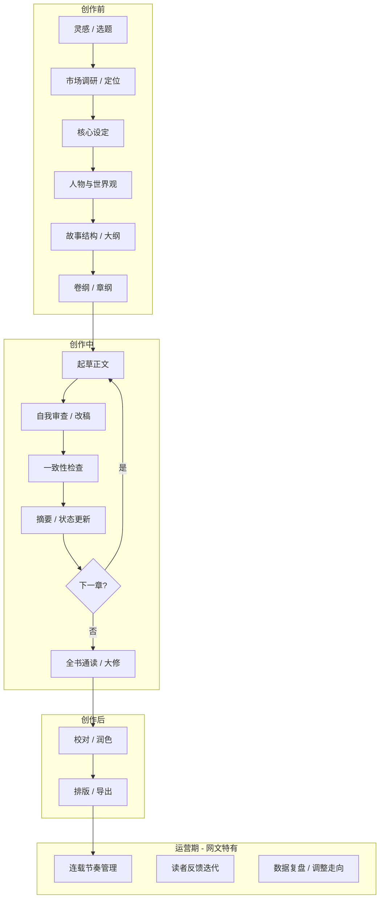
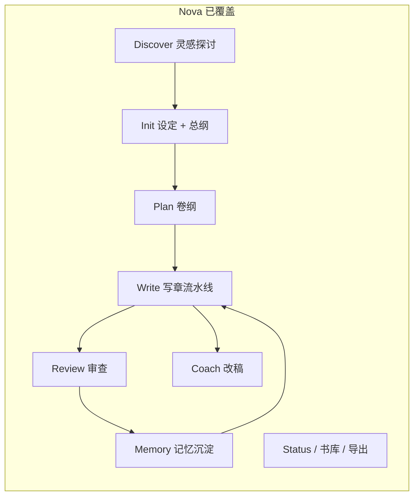
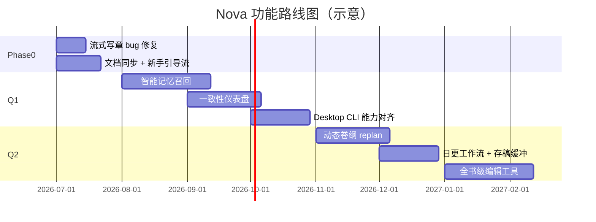

# Nova 产品分析与功能路线图

> 版本：v0.1  
> 最后更新：2026-07-01

本文档汇总 Nova / agent_nova 的产品定位分析、优劣势评估，以及按 MVP 优先级排列的功能路线图。

---

## 一、写一本小说的完整流程

可以把流程分成 **创作前 → 创作中 → 创作后 → 运营期** 四个阶段。网文和出版小说在节奏上不同，但骨架是相通的。



### 1. 创作前：把「想写什么」变成「能写下去的结构」

| 步骤 | 作者在做什么 | 关键产出 |
|------|-------------|---------|
| **灵感探索** | 从模糊想法里收敛方向 | 题材、调性、核心卖点 |
| **市场定位** | 判断读者、竞品、差异化 | 类型标签、目标字数、更新节奏 |
| **核心设定** | 世界观规则、力量体系、时代背景 | 设定文档 |
| **人物设计** | 主角弧光、配角功能、反派动机 | 人物卡 |
| **故事结构** | 三幕/起承转合、主线支线 | 总纲 |
| **细纲** | 卷纲 → 章纲，每章冲突与爽点 | 可执行的写作任务书 |

这一阶段的核心问题是：**后面 100 章能不能不跑偏**。设定越清晰，后面 AI 或人工写作越不容易「忘设定、乱编情节」。

### 2. 创作中：稳定产出 + 保持连贯

| 步骤 | 作者在做什么 | 关键产出 |
|------|-------------|---------|
| **上下文准备** | 回顾上章、查设定、看伏笔 | 写作 brief |
| **起草** | 按章纲写正文 | 章节草稿 |
| **审查改稿** | 节奏、钩子、爽点、文风 | 定稿 |
| **状态沉淀** | 角色变化、伏笔埋/收、新设定 | 摘要 + 记忆库 |
| **进度管理** | 字数、卷进度、断更风险 | 仪表盘 |

网文还要额外关注：**每章结尾钩子、爽点密度、悬念债（debt）**——读者会不会点下一章。

### 3. 创作后：从「能看」到「能发」

- 全书结构大修（删支线、补伏笔）
- 语言润色、错别字校对
- 导出 EPUB / 投稿格式
- 封面、简介、标签（若上架）

### 4. 运营期（连载场景）

- 按日/周更新计划执行
- 根据评论、数据调整后续卷纲
- 多本书并行时的精力分配

---

## 二、Nova 在这条链路上覆盖了什么

Nova 的产品定位：**Markdown 真源 + SQLite 读模型 + 多角色 Agent 流水线**，专门解决长篇连载里 LLM 的「遗忘」和「幻觉」。



| 通用流程 | Nova 对应能力 |
|---------|--------------|
| 灵感探索 | `Discover` 多轮对话 → 自动提炼书名/主角/金手指 |
| 设定与世界观 | `设定集/*.md` + Init Agent 按题材模板生成 |
| 总纲 / 卷纲 | `大纲/总纲.md`、`大纲/第NN卷.md` + Plan Agent |
| 写作 brief | ContextAgent 生成「任务书」 |
| 起草 | WriteAgent 流式写正文 |
| 审查改稿 | Review + Coach + 选区快捷改写 |
| 一致性 | memories / entities / foreshadows + Gate 门禁 |
| 进度管理 | Overview、health todos、library 多书管理 |
| 导出 | Markdown / TXT / EPUB |

CLI 和 Nova Studio 共用同一套 Go 工作流引擎：**GUI 不是另一套逻辑，而是同一 pipeline 的可视化壳**。

---

## 三、做得好的地方

### 1. 产品定位准确，切中了真实痛点

README 和 `docs/memory.md` 都写得很清楚：长篇连载里 LLM 会忘设定、会幻觉。没有做成「又一个 ChatGPT 壳」，而是围绕 **结构化记忆 + 流水线** 来设计，用更轻量的 Markdown + SQLite 实现，对作者更友好（文件可读、可手改、可 git 管理）。

### 2. 写章流水线设计成熟，不是「一次 prompt 写完」

`write` 的内部步骤：

> Gate → 上下文快照 → 任务书 → 起草 → 审查润色 → 摘要 → 事实抽取 → 索引/备份

把创作拆成多个专职 Agent，而不是让一个模型包办一切。Gate 机制（没卷纲、没上章摘要就不让写）能避免很多「裸写跑偏」的问题。

### 3. 记忆体系有完整设计文档，且和代码对齐

`memories`、`entities`、`foreshadows`、`cool_points` 分工明确：

- **摘要链** → 近章剧情连贯
- **记忆表** → 跨章可复用知识
- **实体表** → 结构化角色/物品状态
- **伏笔表** → 埋设与回收追踪

还有 `nova learn` 把作者反馈转成记忆，是「人机协作沉淀知识」的正确方向。

### 4. 改稿链路完整

- **Coach**：讨论式改稿 + diff + 版本回滚
- **选区快捷操作**：润色 / 扩写 / 缩略 / 对话优化
- **章节版本历史**：写稿、审查、改稿都有快照

对网文作者来说，**改稿频率往往高于从零写**，这块很实用。

### 5. 审查维度贴近网文

Review 里的 hook score、cool point、debt（悬念债）等指标，说明理解网文节奏，不是泛泛的「语法检查」。

### 6. 工程化程度高

- CLI + Desktop + Dashboard + Daemon 多入口
- FTS 全文搜索、可选 embedding
- 多书 library、备份、doctor/preflight
- 断点续写（run_ledger）
- 导出 EPUB

底层能力已经比很多「Demo 级 AI 写作 app」完整得多。

### 7. Nova Studio 的信息架构合理

Library → Studio 五 Tab（概览 / 规划 / 章节 / 记忆 / Wiki）基本覆盖了日常写作动线。Overview 的 health todos（缺卷纲、缺审查、该写下一章）降低了「不知道该干嘛」的认知负担。

---

## 四、还需要改进的地方

### A. 核心体验缺口（影响「能不能放心连载」）

#### 1. 记忆注入太「朴素」，和设计的野心不匹配

`docs/memory.md` 写得很完整，但实现上是 **按时间取最新 10 条记忆**（`ContextBuilder.Build` → `QueryMemories("", "", 10)`），没有按当前章节/卷纲做语义相关性排序；embedding 表存在，却 **没有接入 Write 上下文**。

**影响**：写到第 80 章时，注入的可能是「最近写的杂项记忆」，而不是「本章相关的角色关系、未收伏笔、世界观约束」。

**建议**：

- 写章时按「当前章纲关键词 + 涉及实体 + 开放伏笔」做 hybrid 召回（FTS + embedding + 规则）
- 记忆冲突检测已有，应补上 **合并/归档/人工确认** 工作流，而不只是报告

#### 2. 缺乏「全书级」一致性视图

有单章 review、有 foreshadow 列表，但缺少：

- **跨章矛盾检测**（第 12 章说 A 死了，第 45 章 A 又出现）
- **设定漂移报告**（力量体系、时间线、地理）
- **伏笔健康度仪表盘**（埋了 30 条，只收了 8 条，哪些超期未收）

长篇作者最怕的不是「这一章写得差」，而是 **300 章后发现逻辑崩了**。

#### 3. 规划阶段偏「卷纲」，弱于「结构层」

Plan 主要生成 **卷级章纲**，对以下支持不足：

- 三幕 / 主线支线 / 高潮点分布的可视化
- 总纲与卷纲的 **结构校验**（是否偏题、节奏是否过平）
- 根据已写内容 **动态调整后续卷纲**

网文常中途改走向；产品应支持「已写 50 章 → 重新规划 51–100 章」且自动对齐已有事实。

### B. 创作流程缺口（完整链路里还缺环）

#### 4. 创作前：市场调研与定位几乎空白

Discover 擅长从 **作者脑内** 收敛想法，但不帮作者回答：

- 这个题材竞品多不多？
- 同类书的爽点模式是什么？
- 目标更新字数/节奏建议？

对想「靠写作吃饭」的用户，**选题 > 文笔**。可以加轻量「类型模板 + 结构 checklist」，不必做重数据平台。

#### 5. 创作后：全书级编辑能力弱

现有能力偏 **单章**：

- 缺全书大纲 ↔ 正文的 **对照视图**
- 缺「删章 / 合并章 / 插章」后的 **级联更新**（摘要链、记忆、章号）
- 缺批量润色、统一人称/称谓、敏感词/平台规则检查

#### 6. 运营期：连载管理几乎未覆盖

- 无更新日历 / 存稿缓冲提醒
- 无「今日目标字数」与 streak
- 无读者反馈入口（哪怕只是手动粘贴评论让 AI 分析）
- 无简单数据面板（收藏、追读——哪怕先支持手动录入）

网文作者的 daily workflow 是 **「今天更几章」**，而不只是「打开 Studio 写一章」。

### C. 产品体验与界面

#### 7. CLI 与 Desktop 能力不对齐

Desktop 缺：`learn`、backup、doctor、preflight、memory bootstrap、批量连续写章等。作者一旦在 GUI 里卡住，还要回终端，体验割裂。

#### 8. 写章流式体验有已知 bug

WritePanel 切换 Tab 后，已流式输出的内容可能丢失，只剩后续 delta。对长章（3000–5000 字）这是 **高感知 bug**。

#### 9. Dashboard 与 Daemon 能力偏窄

Dashboard 只读；HTTP API 主要服务 async write，没有 plan/review/coach。若未来做「手机上看进度 / 远程触发写章」，API 面需要扩展。

#### 10. 文档滞后

`docs/desktop.md` 仍把 Discover、Review、Memory 标成未来功能，但代码已实现。新用户会被文档误导，也反映 **产品迭代快于文档**。

### D. 架构与长期演进

#### 11. memories 与 entities 边界模糊

文档已承认重叠。作者和 AI 都可能不知道「这条该进 memory 还是 entity」。需要更清晰的 UI 分区与自动分类规则，写章 Extract 阶段减少重复写入。

#### 12. 无协作与同步

纯本地单作者工具，对团队共创、编辑审稿、多设备同步是空白。不一定是现在要做，但会限制用户群从「个人 hobbyist」扩到「职业作者 / 工作室」。

#### 13. 模型与成本透明性

长篇连载 API 成本很高。产品层缺少：

- 每章 / 每流水线步骤的 token 估算
- 模型选择建议（起草用大模型、摘要用小模型）
- 本地 Ollama 与云端的 **质量/成本 tradeoff 引导**

---

## 五、优劣势对照表

| 维度 | 现状评价 | 说明 |
|------|---------|------|
| 灵感 → 初始化 | ⭐⭐⭐⭐ | Discover + 题材模板 Init 很强 |
| 结构规划 | ⭐⭐⭐ | 卷纲好，缺全书结构与动态 replan |
| AI 写章流水线 | ⭐⭐⭐⭐⭐ | 业内少见的完整度 |
| 改稿 / 版本 | ⭐⭐⭐⭐ | Coach + 选区 + 版本历史 |
| 记忆 / 一致性 | ⭐⭐⭐ | 设计好，注入与冲突处理待加强 |
| 审查质量 | ⭐⭐⭐⭐ | 网文维度指标有差异化 |
| 连载运营 | ⭐ | 基本空白 |
| 全书后期 | ⭐⭐ | 偏单章，缺通读大修工具 |
| 多端 / 协作 | ⭐⭐ | CLI 强，Desktop 未对齐，无云 |
| 作者 onboarding | ⭐⭐⭐⭐ | 新手引导 checklist + 书库空态三步说明 |

**总结**：Nova 在「AI 辅助单章生产」这一段已经明显强于大多数同类工具；差距主要在 **长篇全生命周期**（规划动态调整、全书一致性、连载运营、后期大修）以及 **记忆系统从「有」到「真的管用」** 的最后一公里。

> **2026-07-01 更新**：Phase 0（流式恢复、文档、新手引导、Token 统计）已在 Nova Studio 落地，详见上文 Phase 0 完成记录。

## 六、功能路线图（MVP 优先级）

### 6.1 北极星与排序原则

**北极星指标**：作者能 **连续连载 50+ 章**，且 **设定/伏笔/角色状态无明显矛盾**。

**排序原则**（每条功能过这四问）：

| 问题 | 权重 |
|------|------|
| 是否直接降低「遗忘 / 幻觉 / 崩设定」？ | 最高 |
| 是否减少作者在不同界面/CLI 间跳转？ | 高 |
| 是否提升「第一次用到写出第一章」的转化率？ | 中 |
| 是否偏运营/协作/商业化？ | 后置 |

### 6.2 路线图总览



---

### Phase 0：快赢（约 2–4 周）— ✅ 已完成（2026-07-01）

目标：**修高感知 bug、降低上手门槛**，不动大架构。

#### P0-1：修复 WritePanel 流式内容丢失 — ✅

| 项 | 内容 |
|----|------|
| **问题** | 写章中途切 Tab，已输出正文可能丢失 |
| **方案** | Job 层持久化 stream buffer；前端重连时拉全量 + 增量 |
| **实现** | `desktop/write.go` 写章任务内维护 `streamText` 缓冲；新增 `GetWriteJobState` / `GetActiveWriteJob().state`；`WritePanel` 挂载时恢复 + 进行中每 3s 同步 |
| **成功标准** | 切 Tab / 最小化 / 重开 Studio，流式内容 100% 可恢复 |

#### P0-2：同步 `docs/desktop.md` + README 能力清单 — ✅

| 项 | 内容 |
|----|------|
| **问题** | 文档仍把已实现功能标为「未来」 |
| **方案** | 按 Studio 五 Tab 重写 desktop 文档；README 加「CLI vs Desktop 能力对照表」 |
| **实现** | 重写 `docs/desktop.md`；README 新增 Nova Studio 与能力对照节 |
| **成功标准** | 新用户 10 分钟内知道该用 GUI 还是 CLI |

#### P0-3：新手引导流（Desktop First Run）— ✅

| 项 | 内容 |
|----|------|
| **用户故事** | 第一次打开 Studio，不知道先 Discover 还是先 Plan |
| **方案** | Library 空态 → 3 步向导；Overview 显示线性 checklist |
| **实现** | `OnboardingChecklist` 组件（概览 Tab）；`LibraryPage` 空态三步说明；localStorage 按书 dismiss |
| **成功标准** | 零 CLI 经验用户，30 分钟内产出第 1 章草稿 |

#### P0-4：Token / 成本粗估（写章完成后展示）— ✅

| 项 | 内容 |
|----|------|
| **价值** | 长篇连载 API 成本是真实痛点 |
| **方案** | 在 write job 结果里汇总各 step token；Overview 显示本书累计 |
| **实现** | `internal/agent/usage.go` 累计用量；写章报告 `token_usage`；`.nova/usage_stats.json` 项目累计；`WriteCompletionBar` + 概览 `TokenUsageCard` |
| **成功标准** | 作者能感知「写一章大概花多少钱」 |

---

### Q1（第 1–3 个月）：核心差异化

目标：**把「记忆系统」从「有设计」变成「真的管用」**，并补齐 Desktop 关键缺口。

#### Q1-A：智能记忆召回（P0 级，最高优先）— ✅ 已完成（2026-07-01）

**现状**：~~`ContextBuilder.Build` 固定 `QueryMemories("", "", 10)` 按时间取最新 10 条~~ → 已实现规则 + 语义 RRF 召回。

**目标**：写第 N 章时，注入的是 **与本章相关** 的记忆，而不是「最近 10 条杂项」。

**实现路径（分三期，可在 Q1 内迭代交付）**：

| 阶段 | 能力 | 状态 | 技术要点 |
|------|------|------|----------|
| **A1** | 规则召回 | ✅ | `internal/context/recall.go`：章纲关键词 + entities + 主角锚点打分 |
| **A2** | 语义召回 | ✅ | 章纲 + 近 3 章摘要 → `SearchEmbeddings`；`nova index embed` 已索引 memories |
| **A3** | 预算控制 | ✅ | 记忆段 ~2400 字上限；Top-10；RRF k=60 |

**涉及文件**：`internal/context/recall.go`、`builder.go`、`internal/index/embeddings.go`、`desktop/search_context.go`、`WriteContextPanel.tsx`

**成功标准**：

- ✅ WriteContextPanel 可看到「为何选中这条记忆」（source + reason）
- 写第 50 章时 ≥70% 记忆与章纲相关（需人工抽检，持续调优权重）

#### Q1-B：一致性仪表盘（P0 级）— ✅ 已完成（2026-07-01）

**目标**：作者在 **第 20 章** 就能看见风险，而不是第 200 章才发现崩了。

**MVP 功能清单**：

| 模块 | 能力 | 状态 |
|------|------|------|
| **伏笔健康** | 开放伏笔 + 间隔 + 超期标红（≥20 章 warn，≥40 章 critical） | ✅ |
| **实体冲突** | 同名实体重复、实体 stale（≥30 章未更新） | ✅ |
| **记忆冲突** | 检测 + **合并/归档** 工作流 | ✅ |
| **跨章矛盾** | 轻量：角色类记忆无对应 entity | ✅ |

**入口**：Studio 侧栏「一致性」Tab + Overview 一致性摘要卡片

**成功标准**：

- ✅ Overview 一眼看到：开放伏笔数、超期伏笔数、待处理冲突数
- ✅ 冲突处理闭环：发现 → 合并/归档 memory、标记伏笔回收

#### Q1-C：Desktop ↔ CLI 能力对齐（P1）— ✅ 已完成（2026-07-01）

**优先补齐**（按作者使用频率）：

| 功能 | CLI 命令 | Desktop 形态 | 状态 |
|------|----------|--------------|------|
| 作者反馈学记忆 | `nova learn` | MemoryPanel「从反馈学习」 | ✅ |
| 预检 / 诊断 | `preflight` / `doctor` | Overview「项目工具」体检 | ✅ |
| 备份 | `nova backup` | Overview 立即备份 + 列表恢复 | ✅ |
| 批量写章 | `nova write 1-3` | WritePanel 选项「连续写到第 N 章」 | ✅ |
| Memory bootstrap | `memory bootstrap` | Overview「设定→记忆」 | ✅ |

**成功标准**：✅ 日常写作零强制回 CLI（上述高频操作均可在 Studio 完成）

#### Q1-D：Write 流式体验增强（P1）✅

| 能力 | 说明 |
|------|------|
| 步骤可视化 | WriteStepper 展示每步耗时；选项中可「跳过审查」（高级） |
| 上下文预览 | WriteContextPanel 展示 A1 召回结果，写前可 pin/排除记忆 |
| 断点续写 UI | `GetWriteResumeInfo` + 一键「继续上次」；`write:step` 含 `elapsed_ms` |

**工作量**：S–M（2–3 周）

---

### Q2（第 4–6 个月）：完整生命周期

目标：**从「单章生产工具」升级为「连载项目管理工具」**。

#### Q2-A：动态卷纲 Replan（P1）✅

**用户故事**：写到第 40 章，发现原卷纲不合理，需要调整 41–60 章，且不能 contradict 已写事实。

**MVP**：

1. 「基于已写内容重新规划第 N 卷」工作流 — `PlanWorkflow.ReplanVolume`
2. Plan Agent 输入：总纲 + 已写摘要链 + entities + 开放伏笔 + 当前卷纲
3. 输出：新卷纲 diff，作者确认后替换 — CLI `nova plan replan` / Studio Replan + diff 模态
4. 章纲条目状态：已完成 / 偏离 / 废弃（Markdown 标注）

**工作量**：M–L（4–5 周）

**成功标准**：Replan 后 Gate 检查通过；Extract 事实与新卷纲无硬冲突

#### Q2-B：日更工作流 + 存稿缓冲（P1）✅

| 功能 | 说明 |
|------|------|
| 更新目标 | 每日字数/章数目标（`nova.yaml` + Overview 设置） |
| 存稿计数 | 未发布章数；已审/待发布为存稿就绪 |
| Streak / 日历 | `.nova/writing_activity.json` 本地记录 + 7 日条 |
| Overview 卡片 | 「今日连载」：进度、连续天数、存稿、今日建议 |
| 发布标记 | `SetChapterStatus`：draft / reviewed / scheduled / published |

**工作量**：M（3–4 周）

**成功标准**：作者打开 App 第一眼知道「今天该干嘛、存稿够不够」

#### Q2-C：全书级编辑工具（P2）

| 功能 | 优先级 | 说明 |
|------|--------|------|
| 大纲 ↔ 正文对照 | 高 | 卷纲条目 ↔ 章节完成状态矩阵 |
| 插章 / 删章 | 中 | 章号级联 + 摘要/记忆 source_chapter 更新 |
| 全书通读报告 | 中 | 一次性 LLM 扫描：节奏、重复、未收伏笔 |
| 批量润色 | 低 | 选定章节范围统一人称/称谓 |

**工作量**：L（5–6 周，可分迭代）

#### Q2-D：类型模板 + 结构 Checklist（P2）

不做法案级「市场调研 API」，先做 **轻量创作前工具**：

- 玄幻 / 都市 / 科幻 **结构 checklist**（开局、金手指展示、第一个小高潮…）
- Discover 结束后自动对照 checklist 标「缺失项」
- Plan 时检查卷纲是否覆盖必要 beat

**工作量**：S–M（2–3 周，偏 prompt + 前端）

---

### Backlog（6 个月后 / 按需）

| 功能 | 价值 | 建议时机 |
|------|------|----------|
| HTTP API 扩展（plan/review/coach） | 远程触发、自动化 | 有移动端/CI 需求时 |
| Dashboard 升级为可写 | 轻量 Web 端 | Desktop 稳定后 |
| 读者反馈分析 | 粘贴评论 → AI 归纳 | 有真实连载用户后 |
| 多模型策略（起草大/摘要小） | 降本 | Token 统计有数据后优化 |
| 协作 / 云同步 | 工作室场景 | 有付费意愿的客户 |
| 平台规则 / 敏感词检查 | 上架合规 | 对接具体平台时 |

---

## 七、按角色看的交付节奏

| 用户类型 | Phase 0 | Q1 后 | Q2 后 |
|----------|---------|-------|-------|
| **第一次用 AI 写书** | 引导流 + 文档 | 零 CLI 日常写作 | 日更节奏管理 |
| **连载 30+ 章** | 流式 bug 修 | 智能记忆 + 一致性盘 | Replan + 全书编辑 |
| **CLI 老用户** | Token 统计 | Desktop 不拖后腿 | API 扩展 |
| **想商业化** | — | 成本透明 | 存稿/更新日历 → 再考虑协作 |

---

## 八、建议的团队排期（假设 1–2 名全职开发）

```
7月  Phase 0：P0-1 流式修复 + P0-2 文档 + P0-3 引导流
8月  Q1-A1/A2：智能记忆召回（规则 + embedding）
9月  Q1-B：一致性仪表盘 + Q1-A3 记忆预算
10月 Q1-C：Desktop CLI 对齐 + Q1-D 写章 UX
11月 Q2-A：动态 Replan
12月 Q2-B：日更工作流
1月  Q2-C：全书编辑 MVP（对照视图 + 插删章）
```

若人力紧：**Q1-A + Q1-B 不可砍**（产品差异化核心）；Q1-C 可只做 learn/backup/doctor 三项；Q2 可整体后移 1 个月。

---

## 九、验收清单模板

以 **Q1-A 智能记忆召回** 为例：

- [ ] 写章前 Context 中 memories 非「纯时间排序 Top-10」
- [ ] embedding 索引缺失时有降级（仅 FTS + 规则）
- [ ] WriteContextPanel 展示召回来源与关键词
- [ ] 单元测试：`Build(chapter=50)` 在 seed 数据下命中预期 subject
- [ ] 文档更新：`docs/memory.md` 第 4 节「注入策略」与代码一致

---

## 十、三阶段一句话总结

| 阶段 | 主题 | 最关键的一件事 | 状态 |
|------|------|----------------|------|
| **Phase 0** | 信任与上手 | 修流式 bug + 新手 30 分钟出第一章 | ✅ 已完成 |
| **Q1** | 长篇稳定性 | 记忆「聪明召回」+ 一致性可行动 | ✅ Q1-A/B/C/D 已完成 |
| **Q2** | 连载管理 | Replan + 日更节奏 + 全书编辑 | Q2-A/B ✅；Q2-C 待做 |

当前 Nova **最强的是写章流水线**；路线图的核心是：**把记忆和一致性从「设计文档」变成作者能感知、能操作的产品能力**，然后再扩到连载运营与全书后期。
